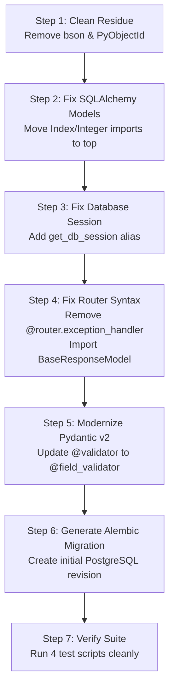

# Technical Audit Report: Thathvamasi HR Consultancy Backend

**Audit Date:** October 5, 2026  
**Audited Target:** `/home/mrishank/thathvamasi/backend`  
**Repository Branch:** `main` (Commit: `6aa0d1d`)  
**Audit Scope:** Codebase Architecture, Database Layer, API & Service Implementations, Security & Authentication, Configuration, and Test Suite Health  

---

## 1. Executive Summary

A comprehensive architectural and static analysis was conducted on the **Thathvamasi HR Consultancy** backend. 

### High-Level Verdict
The project is currently in an **unrunnable state** due to a half-finished migration from **MongoDB (Motor/BSON)** to **PostgreSQL (SQLAlchemy Async/Alembic)**. While significant business logic has been written for candidate registration and file uploads (2,300+ LOC), critical runtime blockers, missing imports, circular dependencies, and syntax errors prevent the application and its test suite from starting.

Additionally, there is a stark discrepancy between the features advertised in the documentation (`README.md`) and the actual implementation: **Auth, Blogs, Clients, and Contact endpoints are 100% placeholder stubs.**

### Audit Health Scorecard

| Dimension | Status | Score | Primary Issues |
| :--- | :---: | :---: | :--- |
| **Startup & Runtime Stability** | 🔴 Critical | **15/100** | Crashes on module import (`ModuleNotFoundError`, `NameError`, `AttributeError`) |
| **Database Architecture** | 🟠 High Risk | **40/100** | Circular imports, missing Alembic migrations, unconfigured session helpers |
| **API Completeness** | 🟡 Partial | **45/100** | Candidates & Uploads written; Auth, Clients, Blogs, Contact are stubs |
| **Pydantic & Validation** | 🟠 High Risk | **50/100** | Pydantic v1 vs v2 signature incompatibilities (`@validator` with `values`) |
| **Security & Auth** | 🔴 Critical | **20/100** | Auth endpoints are stubs; token verification references non-existent MongoDB collections |
| **Configuration & DevOps** | 🟡 Moderate | **60/100** | Pydantic Settings evaluates class-level f-strings before reading `.env` |

---

## 2. Architecture & Migration Conflicts

```
   Existing MongoDB Legacy Artifacts          Target PostgreSQL Architecture
┌───────────────────────────────────────┐   ┌─────────────────────────────────────┐
│ • mongo-init.js                       │   │ • docker-compose (postgres 15)      │
│ • app/models/base.py (PyObjectId)     │   │ • app/models/*_model.py (SQLAlchemy)│
│ • app/models/candidate.py (Pydantic)  │   │ • alembic / alembic.ini             │
│ • app/core/security.py (get_users_col)│   │ • asyncpg + SQLAlchemy AsyncSession │
└───────────────────┬───────────────────┘   └──────────────────┬──────────────────┘
                    │                                          │
                    └───► INCOMPLETE MIGRATION COLLISION ◄─────┘
                           • bson imports crash Python runtime
                           • database.py imports models, models import database.py
                           • app/models/__init__.py mixes both models
```

The repository contains two distinct architectural generations coexisting in the same directories:
1. **Legacy MongoDB Stack:** Relied on Motor, Pydantic Document models (`app/models/candidate.py`, `client.py`, `blog.py`, `user.py`, `contact.py`), and `bson.ObjectId`.
2. **Current PostgreSQL Stack:** Uses SQLAlchemy Async (`app/models/candidate_model.py`, `client_model.py`, `blog_model.py`, `user_model.py`), `asyncpg`, and Alembic.

Because `app/models/__init__.py` still attempts to import and export the old MongoDB schemas alongside the new SQLAlchemy models, importing *any* model pulls in obsolete definitions and causes immediate import failures.

---

## 3. Critical Findings & Code Defects

### 🔴 Critical Blocker 1: Residual `bson` / MongoDB Imports
* **File:** [`backend/app/utils/helpers.py`](backend/app/utils/helpers.py#L8)
* **Lines:** 8, 111–112
* **Issue:** 
  ```python
  from bson import ObjectId  # <-- Fails with ModuleNotFoundError: No module named 'bson'
  ```
  `bson` is not listed in `requirements.txt`. Because `cloudinary_service.py` imports `helpers.py`, all upload and candidate services crash on import.

### 🔴 Critical Blocker 2: Deleted `PyObjectId` Referenced in Models Init
* **File:** [`backend/app/models/__init__.py`](backend/app/models/__init__.py#L5-L11)
* **Issue:**
  ```python
  from app.models.base import (
      BaseDBModel,
      BaseResponseModel,
      PaginatedResponse,
      ErrorResponse,
      PyObjectId  # <-- Does not exist in app/models/base.py!
  )
  ```
  `app/models/base.py` was updated to use standard UUIDs, but `__init__.py` still attempts to import `PyObjectId`. This causes `ImportError: cannot import name 'PyObjectId'` whenever `app.models` is traversed.

### 🔴 Critical Blocker 3: Missing & Late `Index` Imports in SQLAlchemy Models
* **Files:**
  - [`backend/app/models/candidate_model.py`](backend/app/models/candidate_model.py#L55) (Never imported)
  - [`backend/app/models/user_model.py`](backend/app/models/user_model.py#L111) (Imported on line 111, after class definitions)
  - [`backend/app/models/client_model.py`](backend/app/models/client_model.py#L510) (Imported on line 510, after class definitions)
  - [`backend/app/models/blog_model.py`](backend/app/models/blog_model.py#L247) (Imported on line 247, after class definitions)
* **Issue:**
  SQLAlchemy parses `__table_args__` at class declaration time:
  ```python
  __table_args__ = (
      Index('ix_candidates_status', 'status'),  # <-- NameError: name 'Index' is not defined
  )
  ```
  Because `Index`, `Integer`, and `JSON` were either never imported or appended to the bottom of the files, instantiating these models raises immediate `NameError` exceptions.

### 🔴 Critical Blocker 4: Invalid APIRouter Exception Handlers
* **File:** [`backend/app/api/candidates/router.py`](backend/app/api/candidates/router.py#L34-L58)
* **Lines:** 34, 42, 50
* **Issue:**
  ```python
  @router.exception_handler(NotFoundError)  # <-- APIRouter has NO exception_handler method!
  async def not_found_exception_handler(request: Request, exc: NotFoundError):
  ```
  In FastAPI, `@app.exception_handler` is exclusively supported on `FastAPI` application instances, not on `APIRouter` instances. Importing `candidates/router.py` throws:
  `AttributeError: 'APIRouter' object has no attribute 'exception_handler'`.

### 🔴 Critical Blocker 5: `get_db_session` Function Name Mismatch
* **Files:**
  - [`backend/app/api/candidates/router.py`](backend/app/api/candidates/router.py#L14)
  - [`backend/app/services/candidate_service.py`](backend/app/services/candidate_service.py#L28,L650)
* **Issue:**
  Both modules execute:
  ```python
  from app.core.database import get_db_session
  ```
  However, `backend/app/core/database.py` defines the generator as `get_db()`, not `get_db_session()`.

### 🔴 Critical Blocker 6: Unimported `BaseResponseModel` in Upload Router
* **File:** [`backend/app/api/upload/router.py`](backend/app/api/upload/router.py#L21,L98,L175,L265)
* **Issue:**
  ```python
  @router.post("/resume", response_model=BaseResponseModel)
  ```
  `BaseResponseModel` is referenced in 4 routes as the response schema, but is never imported in `upload/router.py`.

### 🔴 Critical Blocker 7: Broken Auth Dependency References Non-Existent MongoDB
* **File:** [`backend/app/core/security.py`](backend/app/core/security.py#L89-L100)
* **Issue:**
  ```python
  async def get_current_user(payload: Dict[str, Any] = Depends(verify_token)):
      from app.models.user import User
      from app.core.database import get_users_collection  # <-- Does not exist in PostgreSQL!
      ...
      users_collection = get_users_collection()
      user_dict = await users_collection.find_one({"email": email})
  ```
  All 8 endpoints in `upload/router.py` protected by `check_admin_permissions` will crash immediately with `ImportError`.

### 🟠 High Risk 8: Pydantic v2 Incompatibility in Field Validators
* **File:** [`backend/app/schemas/candidate.py`](backend/app/schemas/candidate.py#L153,L183)
* **Issue:**
  ```python
  @validator('end_date')
  def validate_dates(cls, v, values):  # <-- In Pydantic v2, 'values' is invalid
      if v and 'start_date' in values and v < values['start_date']: ...
  ```
  Pydantic v2 replaces `values` with `ValidationInfo` (`info.data`). Running candidate validation throws:
  `pydantic.errors.PydanticUserError: The 'field' and 'config' parameters are not available in Pydantic V2`.

### 🟠 High Risk 9: Dynamic Config Evaluates Class Attributes Too Early
* **File:** [`backend/app/core/config.py`](backend/app/core/config.py#L41-L42)
* **Issue:**
  ```python
  DATABASE_URL: str = f"postgresql+asyncpg://{POSTGRES_USER}:{POSTGRES_PASSWORD}@{POSTGRES_HOST}:{POSTGRES_PORT}/{POSTGRES_DB}"
  ```
  In Pydantic v2 `BaseSettings`, f-strings declared at class level are evaluated once when Python parses the class, using default values (`thathvamasi:password@localhost...`). If a user configures a remote database host or credentials in `.env`, `DATABASE_URL` will **ignore** the `.env` settings. A `@computed_field` or property must be used.

### 🟠 High Risk 10: Empty Alembic Migrations
* **Directory:** [`backend/alembic/versions/`](backend/alembic/versions/)
* **Issue:**
  The `versions/` directory has 0 migration files. The container startup command in `backend/Dockerfile` runs `alembic upgrade head`. Because no migrations exist, PostgreSQL will have no tables, and runtime SQL queries will fail with `relation "candidates" does not exist`.

---

## 4. API Completeness Matrix

| Endpoint Group | Router Path | Declared in README | Actual Implementation Status |
| :--- | :--- | :---: | :--- |
| **Candidate Registration** | `/api/candidates/` | Yes | 🟡 **Written (1557 LOC)**, blocked by imports & schema errors |
| **File Upload (Cloudinary/Local)** | `/api/upload/` | Yes | 🟡 **Written (755 LOC)**, blocked by auth & schema errors |
| **Authentication & Users** | `/api/auth/` | Yes | 🔴 **Stub Only**: Returns `"Under construction"` |
| **Client Hiring Requirements** | `/api/clients/` | Yes | 🔴 **Stub Only**: Returns `"Under construction"` |
| **Blog CMS** | `/api/blogs/` | Yes | 🔴 **Stub Only**: Returns `"Under construction"` |
| **Contact & Inquiries** | `/api/contact/` | Yes | 🔴 **Stub Only**: Returns `"Under construction"` |
| **Email Notification Dispatch** | Background | Yes | 🔴 **Not Implemented**: No email sending service |

---

## 5. Security & Code Quality Observations

1. **Hardcoded Secrets & Defaults:**
   - `setup-dev.sh` sets default password `password` and admin password `admin123`.
   - `docker-compose.yml` hardcodes `JWT_SECRET_KEY=development-secret-key-change-in-production`.
2. **DNS Blocking in Offline/Sandbox Environments:**
   - `backend/app/core/validation.py` calls `email_validator.validate_email(email)` without `check_deliverability=False`. In airgapped or test environments, valid emails (e.g. `test@example.com`) fail validation due to DNS timeouts.
3. **Bottom-of-File Imports (Anti-Pattern):**
   - Repeated in `user_model.py`, `client_model.py`, `blog_model.py`, `candidate_service.py`, and `error_handler.py`. All imports should be organized at the top of the file following PEP 8.
4. **Orphaned Files in Repository Root:**
   - `mac.md`: Stray file with single word `hello`.
   - `mongo-init.js`: Obsolete MongoDB replica set script.

---

## 6. Actionable Remediation Roadmap



### Remediation Details

#### Phase 1: Unblock Python Imports & Runtime (Immediate)
1. **Clean Helpers:** Remove `from bson import ObjectId` from `app/utils/helpers.py` and replace with `UUID` or `str` serialization.
2. **Clean Models Init:** Remove `PyObjectId` and legacy Mongo model imports from `app/models/__init__.py`.
3. **Move Imports to Top of Models:** In `candidate_model.py`, `user_model.py`, `client_model.py`, and `blog_model.py`, import `Index`, `Integer`, `JSON`, and `Float` at the top of the files.
4. **Fix Session Alias:** In `app/core/database.py`, add `get_db_session = get_db` to satisfy candidate and service imports.
5. **Fix Router Exception Handlers:** In `app/api/candidates/router.py`, remove the `@router.exception_handler` decorators (exception handling is already handled by `ErrorHandlerMiddleware` in `app/main.py`).
6. **Fix Missing Schemas in Upload Router:** Import `BaseResponseModel` from `app.schemas.base` into `app/api/upload/router.py`.

#### Phase 2: Schema Modernization & Settings (Short-term)
7. **Refactor Pydantic Validators:** In `app/schemas/candidate.py`, convert `@validator` using `values` to `@field_validator('end_date')` with `info.data.get('start_date')`. Change `schema_extra` to `json_schema_extra`.
8. **Fix Deliverability Check:** In `app/core/validation.py`, set `validate_email(email, check_deliverability=False)`.
9. **Fix Database URL in Config:** In `app/core/config.py`, convert `DATABASE_URL` and `DATABASE_URL_SYNC` to `@property` methods on `Settings` so `.env` overrides are honored.

#### Phase 3: Database & Feature Implementation (Medium-term)
10. **Generate Initial Migration:** Run `alembic revision --autogenerate -m "initial_tables"` to populate `alembic/versions/`.
11. **Implement PostgreSQL Authentication:** Rewrite `app/core/security.py`'s `get_current_user` to query the PostgreSQL `users` table via `AsyncSession` rather than calling MongoDB.
12. **Implement Stubbed Modules:** Implement database services and routes for Auth, Clients, Blogs, and Contact inquiries.
